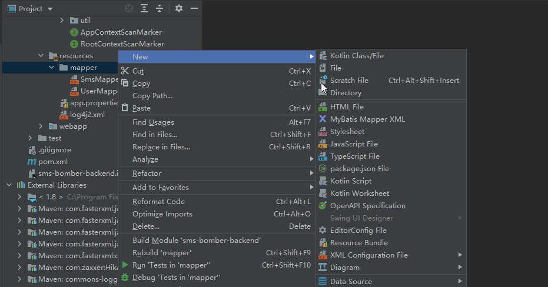
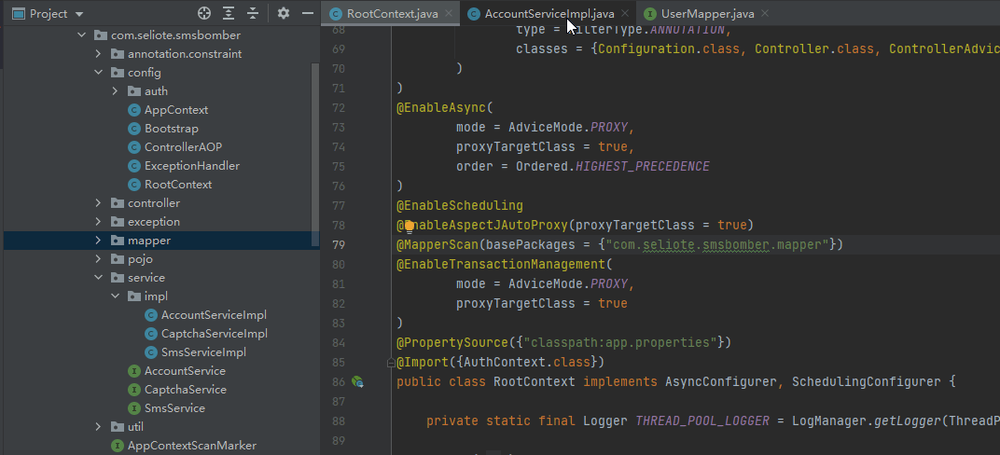
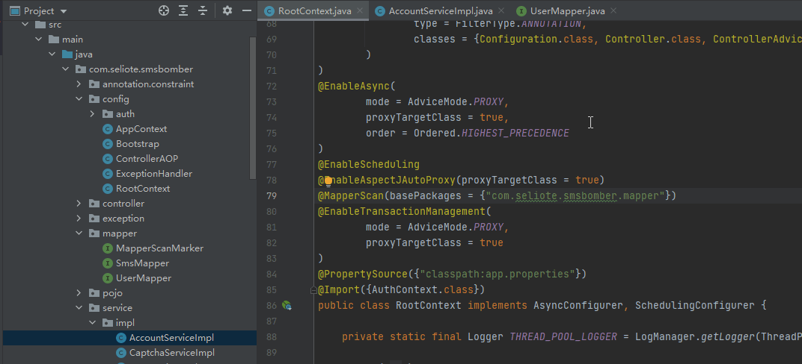

# MyBatis4II #

MyBatis Intellij IDEA plugin, Support:

- Create mapper xml with template(MyBatis in library path)
- Inject mapper bean to Spring framework(Only support @MapperScan)

Thanks for [Cofe-Mybatis](https://github.com/cofedream/Cofe-Mybatis)